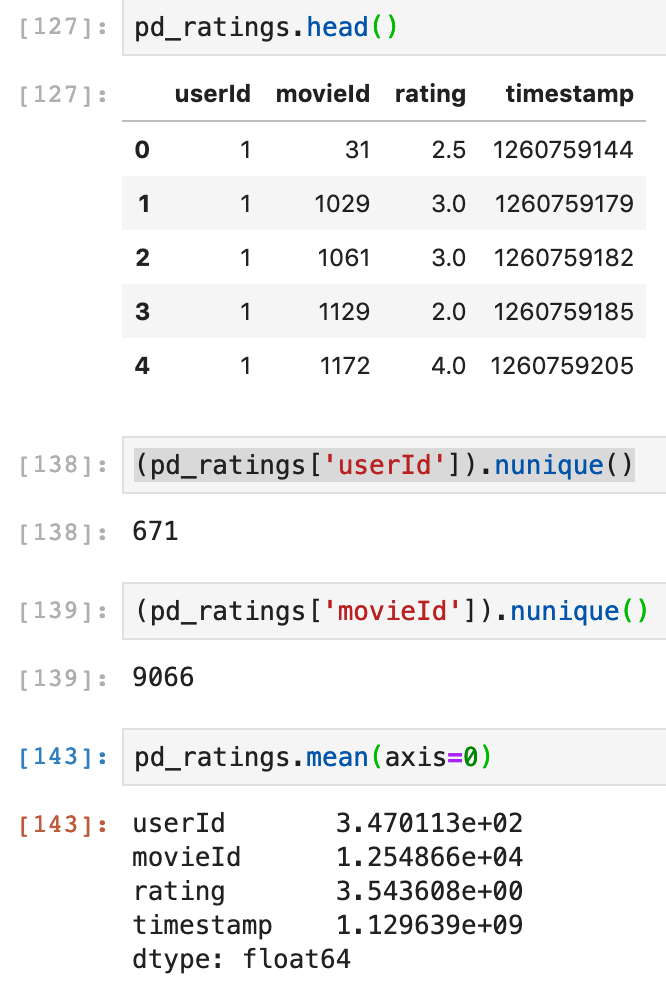
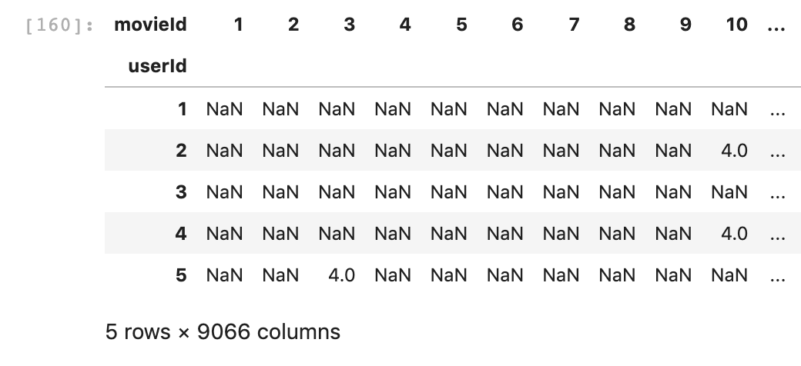
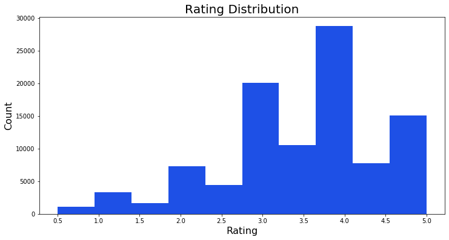
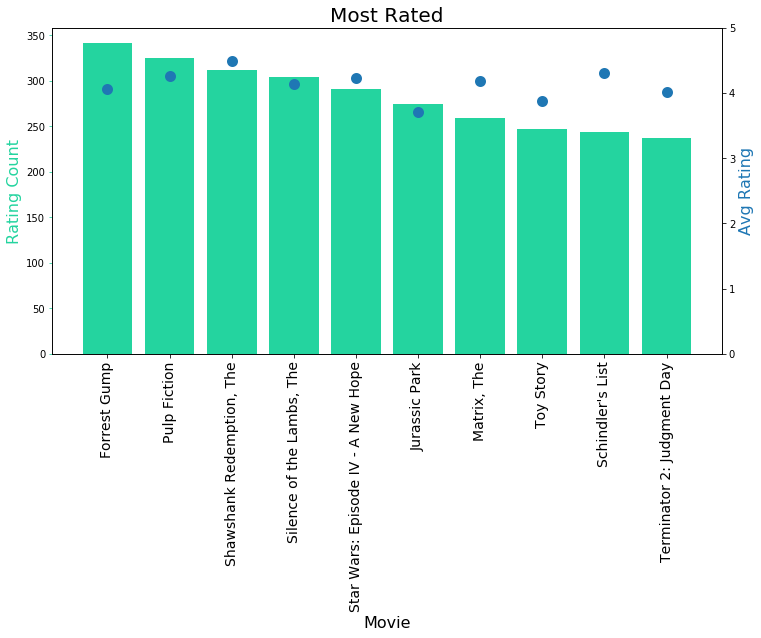
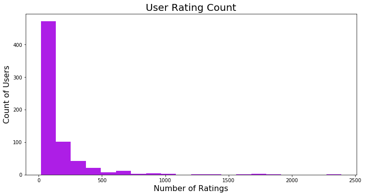
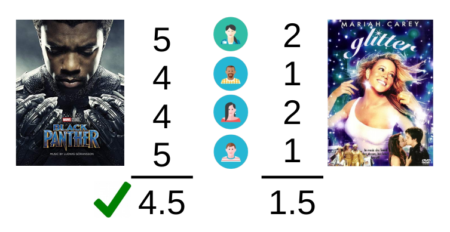
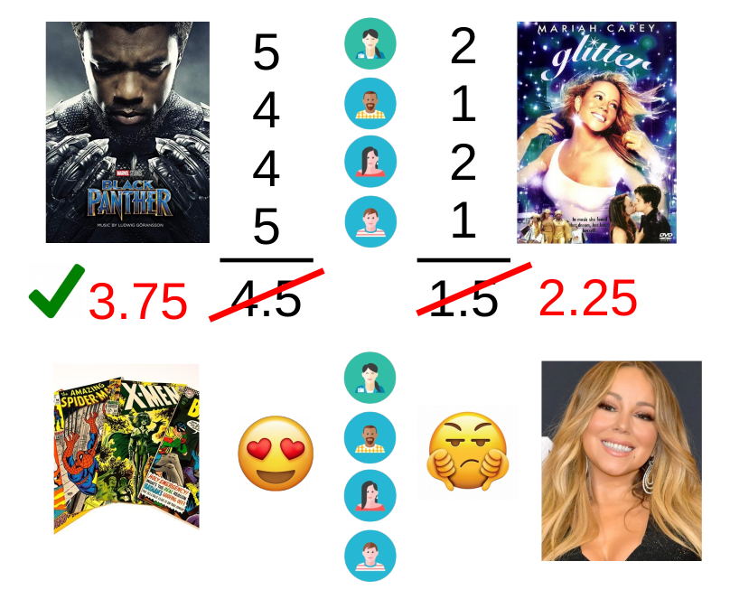
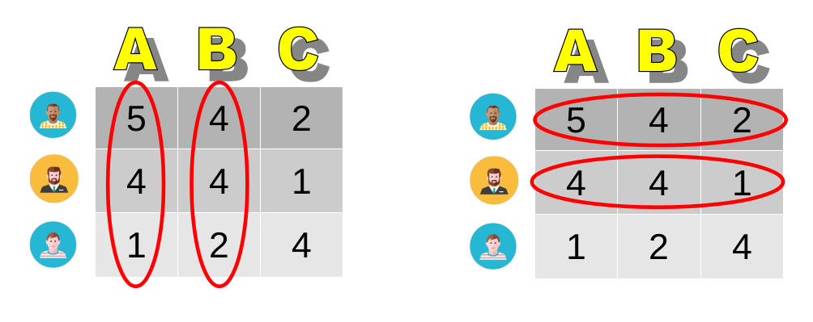
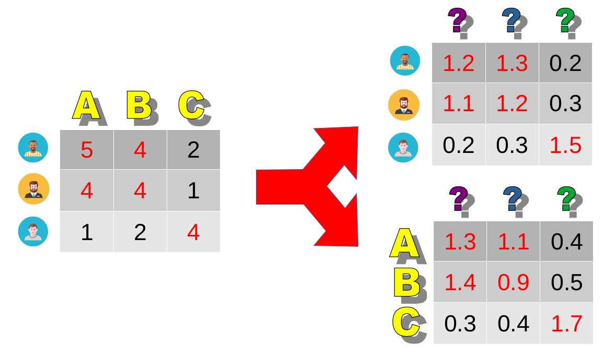
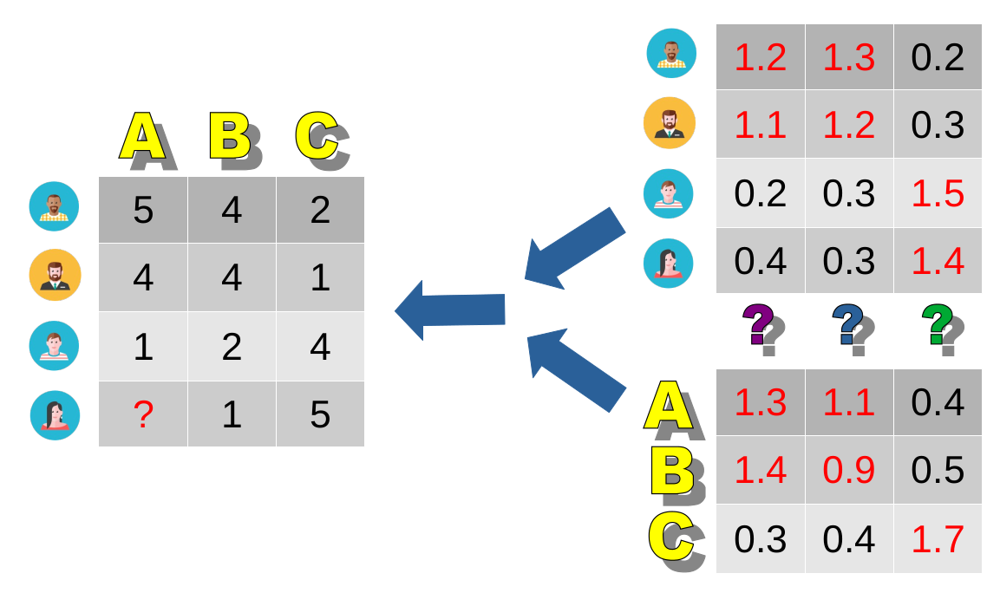

# Movie Recommender Upgrade
Mike De Lancey, Vanessa Davis, Nick Gyongyosi, Fred Berendse

## Data Analysis

&nbsp;

&nbsp;

&nbsp;

## The Current Recommender

The current recommender caculates recommendation using this same "Mean of Means" algorithm. 

Suppose you have not seen the movies *Black Panther* and *Glitter*. You'd likely ask each of your friends to rate these two movies if they've seen them, take the average rating of each movie, and consider the movie with the highest average to be the best recommendation. So if your friends gave *Black Panther* an average rating of 4.5 and *Glitter* an average rating of 1.5, you'd consider *Black Panther* to be your friends' recommendation. 

However, you might hedge your bets knowing that you hang out with friends who love comic books and hate Mariah Carey, so you'd adjust those ratings to compensate for this fact. All the ratings given by your friends averages to a rating of 3, so you might say that an unbiased person would give *Black Panther* an average rating of (4.5+3)/2 = 3.75. That unbiased person would give *Glitter* an average rating of (1.5+3)/2 = 2.25. 

Our example raises some key drawbacks with the "mean of means" algorithm: it doesn't consider the facts that a user prefers to have certain features in their movies (lots of action, a blonde protagonist, or a wicked plot twist) and that not every movie has the same features.
&nbsp;

## The Proposed Recommender

The proposed recommender accounts for the fact that each movie contains a blend of these features and each user prefers a certain blend of these features through an algorithm called "matrix factorization." 

Your first questions might be, "How can we figure out what movies have lots of action? Which movie features are important and which are not? Do we need a large database that lists the features for each movie?" Thankfully, in matrix factorization we don't need to answer those questions.

Let's suppose you have three friends, Emilio, Charlie, and Martin rating movies A, B, and C. Here are the ratings they gave:

Emilio and Charlie like movies A and B, but do not like movie C. We can't name the features that movies A and B share, but we infer that there is *something* they share in common. We also infer that Emilio and Charlie like to see similar features in the movies they watch, yet we have no idea what those features are. In the data science business, we call these "latent" (hidden) features. 

Matrix factorization takes a matrix (*i.e.* a table) of ratings for each user and each movie and factors it into two tables: 1) a table of how much each user likes each latent feature and 2) a table of how much each latent feature is in each movie. 

So how does matrix factorization predict a user's rating for a movie (s)he has not seen? If other users have rated the movie, then the model already knows how much of each latent feature it contains. It also already knows how much the user likes each of those latent features based on other movies that user has rated.

But how do we decide how many of these latent features to use? If we decided there are a large number of important features, we would be able to use our two tables to precisely compute how each user would rate each movie. However, splitting these tables is computationally expensive, so we try to limit the number of latent movie features to a small number. However, choosing a smaller number of latent features results some accuracy loss when we combine the two tables together to calculate a predicted rating. This is a tradeoff we attempt to optimize in our model.
&nbsp;

## Metrics
| Metric | Current Model |  Proposed Model | Change |
|---|---|---|---|
| Model Runtime  | 65 s  | 10.3 s  |  -84% |
| User Recommendation Time  | ?  | 22.5 s | ? |
| Error  | 1.02  | 0.86  |  -15.7% |

&nbsp;
## Sample Recommendations
|  User | 1st  | 2nd  |  3rd | 4th  | 5th  |
|---|---|---|---|---|---|
| Nick Jacobsohn  |  Gate of Heavenly Peace | Hearts and Minds | About Time | This Is Spinal Tap | Sanjuro |
|  Kayla Thomas |  Pride and Prejudice (1940) | Firelight | The Ballad of Ramblin' Jack | Among Giants | Love and Basketball | 

&nbsp;

## Implementation Strategy
We propose initally rolling out this recommendation engine to a random subset of the total userbase, perhaps 10% of the total population. To ensure the new recommendation engine is performing better than the existing system we would split the 10% of users in the experiment in half - one set getting the existing solution (the control set) and the other set receiving the proposed solution (the variant set). After some time, maybe a month, we would assess the results of both models and determine if the new recommendation algorithm performs significantly better than the existing solution. If the new solution does in fact perform better we would then roll it out to the entire user-base.
&nbsp;

## Resources
* [Building and Testing Recommender Systems With Surprise, Step-By-Step](https://towardsdatascience.com/building-and-testing-recommender-systems-with-surprise-step-by-step-d4ba702ef80b)
* [FunkSVD](https://github.com/gbolmier/funk-svd)
